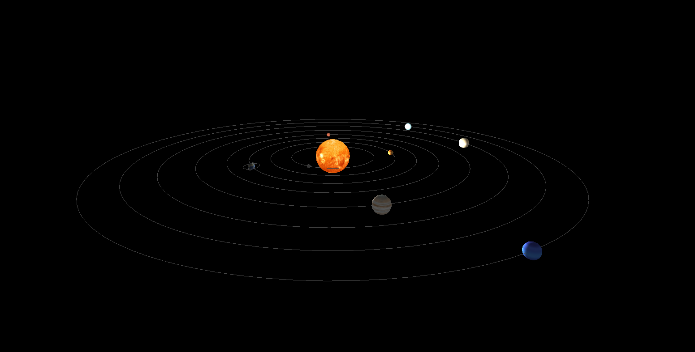

# 🌌 Sistema Solar (COGA)

Este proyecto consiste en una simulación 3D del sistema solar desarrollada con OpenGL. En ella se representan el Sol, los planetas y algunos satélites, cada uno con su propio tamaño, rotación y traslación, permitiendo visualizar de forma sencilla el movimiento del sistema solar en 3D.

### 🎮 Controles

* **ESC** → Cerrar la aplicación
* **Flecha arriba** → Avanzar con la cámara general
* **Flecha abajo** → Retroceder con la cámara general
* **Flecha izquierda** → Girar la cámara general a la izquierda
* **Flecha derecha** → Girar la cámara general a la derecha

### 📷 Enfoques de cámara

* **1** → Enfocar Marte
* **2** → Ver la Tierra desde la Luna
* **3** → Ver la ISS desde la Tierra
* **4** → Volver a la cámara general
* **5** → Enfocar Mercurio desde la Tierra
* **6** → Enfocar Venus desde la Tierra
* **7** → Enfocar Marte desde la Tierra
* **8** → Enfocar Júpiter desde la Tierra
* **9** → Enfocar Saturno desde la Tierra
* **0** → Enfocar Urano desde la Tierra
* **N** → Enfocar Neptuno desde la Tierra
* **L** → Enfocar la Luna desde la Tierra
* **E** → Enfocar la ISS desde la Tierra

### ⚙️ Opciones

* **O** → Mostrar / ocultar órbitas
* **I** → Activar / desactivar la iluminación del Sol
* **S** → Aumentar la velocidad de la simulación
* **B** → Disminuir la velocidad de la simulación

### ✨ Características

* Representación de cuerpos celestes mediante esferas 3D
* Rotación y traslación de los planetas y satélites
* Distintos modos de cámara y enfoque
* Órbitas visibles opcionales
* Iluminación dinámica controlable por teclado
* Aplicación de texturas a los planetas y al fondo espacial

### 🖼️ Texturas

Las texturas utilizadas para los planetas y el fondo espacial han sido obtenidas de:
https://www.solarsystemscope.com/textures/

---
